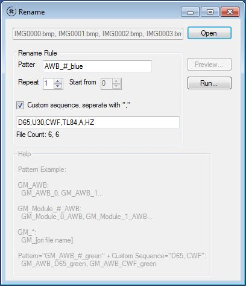
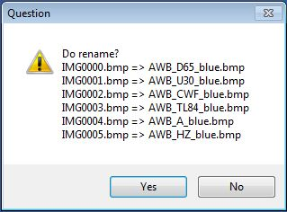

# Re-name tool
A flexible re-name tool
## Examples
### [Ex1] add serial number in # position
* selected file: 
	IMG0001.bmp, IMG0002.bmp, IMG0003.bmp
* Pattern: 
```
	GM_module#_HDR
```    
* renamed file:
	GM_module0_HDR.bmp, GM_module1_HDR.bmp, GM_module2_HDR.bmp

### [Ex2] add padding serial number in # position, padding digit is the number of #
* selected file: 
	IMG0001.bmp, IMG0002.bmp, IMG0003.bmp
* Pattern: 
```
	GM_module##_HDR
```    
* renamed file:
	GM_module00_HDR.bmp, GM_module01_HDR.bmp, GM_module02_HDR.bmp

### [Ex3] add prefix, post fix
* selected file: 
	IMG0001.bmp, IMG0002.bmp, IMG0003.bmp
* Pattern: 
```
	GM_module_*
```    
* renamed file:
	GM_module_IMG0001.bmp, GM_module_IMG0002.bmp, GM_module_IMG0003.bmp

### [Ex4] rename files with diff. extension
* selected file: 
	IMG0001.bmp, IMG0001.csv, IMG0002.bmp, IMG0002.csv, IMG0003.bmp, IMG0003.csv
* Pattern: 
```
	GM_module##_HDR
```    
* renamed file:
	GM_module00_HDR.bmp, GM_module00_HDR.csv, GM_module01_HDR.bmp, GM_module01_HDR.csv, GM_module02_HDR.bmp, GM_module02_HDR.csv

### [Ex5] add custom serial
* selected file: 
	IMG0001.bmp, IMG0002.bmp, IMG0003.bmp
* Pattern: 
```
	GM_AWB_#_green
```
* Custom sequence:
	check on "Custom sequence..." and fill "D65, CWF, TL84"
* renamed file:
	GM_AWB_D65_green, GM_AWB_CWF_green, GM_AWB_TL84_green


